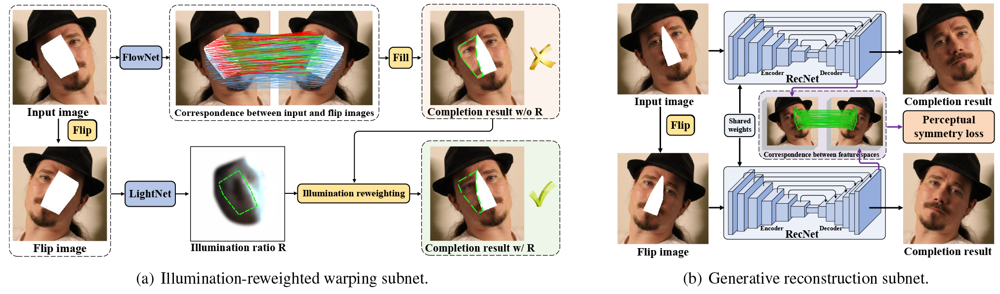

# [SymmFCNet](#)
 Torch implementation for [Learning Symmetry Consistent Deep CNNs for Face Completion](#)

# SymmFCNet framework
Overview of our SymmFCNet. <B>Red</B>, <B>green</B> and <B>blue</B> lines represent the pixel-wise correspondence between the input and the flip image. 
- <B>Red</B>: missing pixels (input) to non-occluded pixels (flip); 
- <B>Green</B>: missing pixels (input) to missing pixels (flip); 
- <B>Blue</B>: remaining pixels (input) to remaining pixels (flip).



# Models
Download the pre-trained model with the following url and put it into ./checkpoints/.
- [BaiduNetDisk](https://pan.baidu.com/s/1V3DglQr6Wx8idMgYUQBhuw)
- [GoogleDrive](https://drive.google.com/open?id=1uSjcNHvcI_mcbei_oOhs8cnDqpuw6Gnh)

# Testing

```bash
th test.lua
```

# Requirements and Dependencies

- [Torch](https://github.com/torch/distro)
- [Cuda](https://developer.nvidia.com/cuda-toolkit-archive)-8.0
- [Stn](https://github.com/qassemoquab/stnbhwd)
