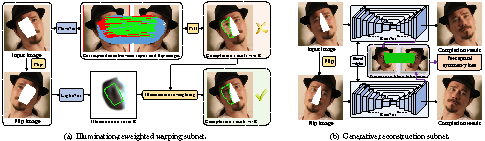

# [SymmFCNet](#)
 Torch implementation for [Learning Symmetry Consistent Deep CNNs for Face Completion](https://arxiv.org/abs/1812.07741)
 
 
 <B>`(New)`</B>Pytorch Version can be found [here](https://github.com/csxmli2016/SymmFCNet_pytorch).
```diff
+ Please note that there are some different implementations between torch and pytorch version. 
+ Please refer to pytorch version (https://github.com/csxmli2016/SymmFCNet_pytorch).
```
# SymmFCNet framework (Torch Version)
Overview of our SymmFCNet. <B>Red</B>, <B>green</B> and <B>blue</B> lines represent the pixel-wise correspondence between the input and the flip image. 
- <B>Red</B>: missing pixels (input) to non-occluded pixels (flip); 
- <B>Green</B>: missing pixels (input) to missing pixels (flip); 
- <B>Blue</B>: remaining pixels (input) to remaining pixels (flip).



# Models
Download the pre-trained model with the following url and put it into ./checkpoints/.
- [BaiduNetDisk](https://pan.baidu.com/s/1V3DglQr6Wx8idMgYUQBhuw)
- [GoogleDrive](https://drive.google.com/open?id=1uSjcNHvcI_mcbei_oOhs8cnDqpuw6Gnh)

# Testing

```bash
th test.lua
```
## Completion results
 <table  style="float:center" width=90%>
 <tr>
  <th><B>Input</B></th><th><B>Results</B></th>
 </tr>
 <tr>
  <td>
  
  </td>
  <td>
   
  </td>
 </tr>
 <tr>
  <td>
  
  </td>
  <td>
   
  </td>
 </tr>
 <tr>
  <td>
  
  </td>
  <td>
   
  </td>
 </tr>
 <tr>
  <td>
  
  </td>
  <td>
   
  </td>
 </tr>
 <tr>
  <td>
  
  </td>
  <td>
   
  </td>
 </tr>
  
 </table>
 
# Requirements and Dependencies

- [Torch](https://github.com/torch/distro)
- [Cuda](https://developer.nvidia.com/cuda-toolkit-archive)-8.0
- [Stn](https://github.com/qassemoquab/stnbhwd)

# Citation

```
@article{li2018learning,
  title={Learning Symmetry Consistent Deep CNNs for Face Completion},
  author={Li, Xiaoming and Liu, Ming and Zhu, Jieru and Zuo, Wangmeng and Wang, Meng and Hu, Guosheng and Zhang, Lei},
  journal={arXiv preprint arXiv:1812.07741},
  year={2018}
}

```
